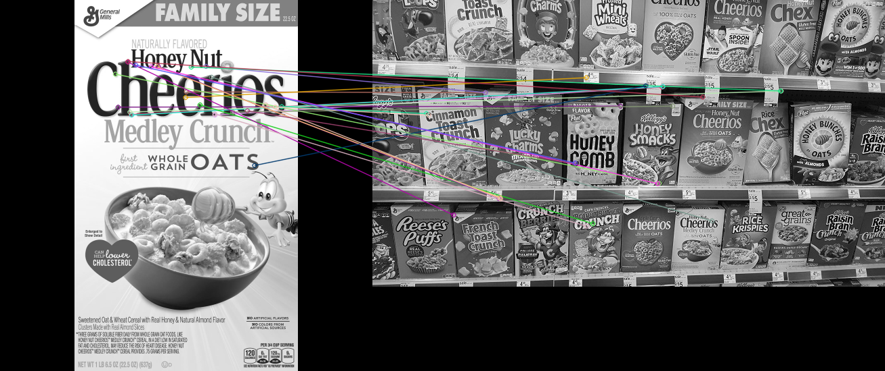
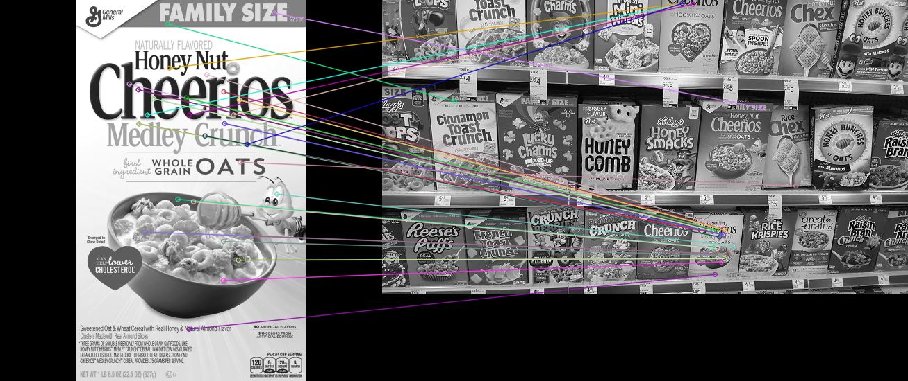
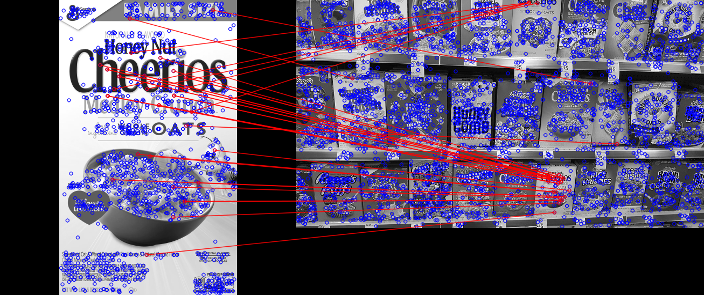

# Görüntü İşlemede Özellik Eşleştirme (Feature Matching)

Bu doküman dosyada bulunan `bf-matcher.py` , `knn-matcher.py` ve `flann-matcher.py` dosyalarının açıklamalarını içerir.

## Algoritmalar 

### 1. BFMatcher (Brute-Force Matcher)

BFMatcher, iki görüntüdeki anahtar noktaların (keypoints) tanımlayıcılarını (descriptors) karşılaştırarak en yakın eşleşmeleri bulur. Bu eşleşmeler, örneğin bir nesnenin farklı açılardan çekilmiş iki fotoğrafında aynı nesneyi tanımak için kullanılır.

#### Python ile Gerçeklemesi

Öncelikle iki resim seçilir. Bunlardan ilki arayacağımız resim olsun, ikinci resimi ise eşleştirme için kullanacağız.

Resimlerimizi okuyoruz. 
```python
cheerios = cv2.imread('assets/cheerios.png',0) 
cereals = cv2.imread('assets/many_cereals.jpg',0)
```

BFMatcher kullanırken ORB algoritmasını kullancağız. Bunun için ORB nesnesini oluşturuyoruz.
```python
orb = cv2.ORB_create()
```

Nesneyi oluşturduktan sonra algılama işlemine geçiyoruz.
Bunun için `detectAndCompute()`fonksiyonunu kullandık.
```python
kp1, des1 = orb.detectAndCompute(cheerios, mask=None)
kp2, des2 = orb.detectAndCompute(cereals, mask=None)
```
Foksiyon bize iki parametre döndürüyor. Bunlar `keypoint`ve`descriptors`. 

**1. `keypoint` (Anahtar Noktalar)**
- `keypoint` aslında bir `cv2.KeyPoint` nesnelerinin listesidir.

- Her `keypoint` içinde şu bilgiler yer alır:

  - pt: Noktanın (x, y) koordinatları

  - size: Anahtar noktanın etkilediği bölgenin çapı

  - angle: Dönme (rotation) bilgisi

  - response: Anahtar noktanın "güvenilirliği" (yüksekse daha belirgin)

  - octave: Çok ölçekli uzayda bulunduğu seviye (örneğin Gaussian piramidinde)

**2. `descriptors` (Tanımlayıcılar)**

Her keypoint için çıkarılan numerik vektörlerdir ve bu vektörler sayesinde benzer noktalar başka bir görüntüde eşleştirilebilir.

- Boyutları: `(keypoint_sayısı, descriptor_uzunluğu)` olur.
- des bir `numpy.ndarray`'dir.
- Tanımlayıcı vektörler, o bölgedeki yapıyı sayısal olarak özetler (örn. gradyan yönleri gibi).

Şimdi BFMatcher için nesnemizi oluşturuyoruz. 

```python
bf = cv2.BFMatcher(cv2.NORM_HAMMING, crossCheck=True)
```
- **`cv2.NORM_HAMMING`**
Bu parametre, descriptor'lar (özellik vektörleri) arasındaki mesafeyi ölçmek için kullanılan norm türünü belirtir.

  - `cv2.NORM_HAMMING`:

    - Hamming mesafesini kullanır.

    - Özellikle binary descriptor’lar için uygundur. Yani __ORB__, __BRIEF__ gibi descriptor algoritmaları tarafından üretilen ikili (0-1'li) descriptor’lar arasında karşılaştırma yapmak için tercih edilir.

    - Hamming mesafesi, iki bit dizisi arasındaki farklı bit sayısını sayar.

    - Örneğin SIFT ya da SURF gibi descriptor’lar float değer içerdiğinden onlarla `cv2.NORM_L2` kullanılır. Ama `ORB` ikili descriptor döndürdüğü için burada `cv2.NORM_HAMMING` kullanılır.
  
- **`crossCheck=True`**

  Bu parametre, eşleşmenin doğruluğunu artırmak için kullanılır.

  - **Cross-check (çapraz kontrol) şunu yapar**:

    - A'dan B'ye eşleşen nokta, B'den A'ya da eşleşiyorsa bu eşleşmeyi geçerli sayar.

    - Yani `descriptor1[i]`, `descriptor2[j]` ile eşleştiyse, `descriptor2[j]` de `descriptor1[i]` ile eşleşmeli.


BFMatcher nesnemiz oluşturuldu. Şimdi ise eşleştirme işlemine geçeceğiz. Bunu için bf nesnesinde olan `match`fonksiyonunu kullancağız. 

```python 
matches = bf.match(des1, des2)
```
`match`fonksiyonuna iki resimin de `descriptor`'larını gönderdik. Bu fonksiyon bize örnek olarak `< cv2.DMatch 0x15e48ae10>`gibi nesneler döndürecek. 

Buradaki iyi eşleşmeler bu nesnelerde bulunan `distance` değişkenine göre yani uzaklığa göre belirleniyor. `macthes.distance`ne kadar düşükse o kadar iyi eşleşme demek oluyor. 

Şimdi de bu uzaklıkları sıralayalım. 

```python 
matches = sorted(matches, key = lambda x:x.distance)
``` 
`matches`artık uzaklıklara göre küçükten büyüğe doğru sıralanmış oldu. 

Bu eşleşmeleri görmek için çizdiriyoruz. 

```python
cheerios_matches = cv2.drawMatches(cheerios, kp1, cereals, kp2, matches[:25], None, flags = 2)
```

`cv2` modulünde bulunan `cv2.drawMatches` fonksiyonunu kullanarak eşleştirmelerimizi çizdiriyoruz. `matches[:25]` ile sıralanmış olan `matches` değişkeninin en iyi 25 tanesini alıyoruz. Böylece en iyi 25 eşleşmeyi çizmiş olacağız. 



--- 

### 2. KNN Matcher (K-Nearest Neighbors Matcher) 

KNN Matcher, görüntüdeki anahtar noktalarını eşleştirirken, her bir anahtar noktasını en yakın K (k en yakın komşu) nokta ile karşılaştırır. Bu algoritma, özellikle descriptor'lar arasında yakın eşleşmeleri bulmada kullanılır ve genellikle çoklu eşleşmeleri değerlendirmek için faydalıdır. KNN eşleştirmesi, sonuçların doğruluğunu artırmak için daha fazla komşu kullanılarak yapılabilir.

#### Python ile Gerçeklemesi 
İlk olarak iki resmi okuyup, eşleştirme yapmak istediğimiz hedef nesneyi ve ana resmi hazırlıyoruz:

```python 
cheerios = cv2.imread('assets/cheerios.png', 0)
cereals = cv2.imread('assets/many_cereals.jpg', 0)
```

**SIFT (Scale-Invariant Feature Transform)** algoritmasını kullanacağız. Bu algoritma, ölçek ve dönüşüm (rotation) invariance sağlar, yani aynı nesne farklı açılardan ve boyutlarda çekilmiş olsa bile onu tespit edebilir.

```python
sift = cv2.SIFT_create()
kp1, des1 = sift.detectAndCompute(cheerios, mask=None)
kp2, des2 = sift.detectAndCompute(cereals, mask=None)
```

**KNN Matcher** kullanırken, **Brute Force (BF) Matcher'ı** seçiyoruz. BFMatcher, descriptor'ları doğrudan karşılaştırarak eşleştirmeleri bulur.

```python
bf = cv2.BFMatcher()
matches = bf.knnMatch(des1, des2, k=2)
```

Bu aşamada her bir descriptor için en iyi iki eşleşmeyi buluyoruz (k=2), böylece daha doğruluğu yüksek eşleşmeleri seçebiliriz.

Şimdi **Lowe's Ratio Test**'i uygulayarak, iki eşleşmeden yalnızca en iyi olanları seçiyoruz. Bu test, daha kötü eşleşmeleri eleyerek yalnızca kaliteli eşleşmeleri tutmamızı sağlar.

```python 
goodMatch = []
for match1, match2 in matches:
    if match1.distance < 0.75 * match2.distance:
        goodMatch.append([match1])
```
Lowe's Ratio Test ile, bir eşleşmenin uzaklığı, diğer eşleşmeden daha küçükse (yani daha yakınsa) o eşleşme iyi kabul edilir.

Son olarak, eşleşmeleri görselleştiriyoruz:

```python
sift_matches = cv2.drawMatchesKnn(cheerios, kp1, cereals, kp2, goodMatch, None, flags=2)
```
Bu şekilde, eşleşmeleri en iyi 78 olarak seçiyoruz ve görselde gösteriyoruz.




---

### 3. FLANN Matcher (Fast Library for Approximate Nearest Neighbors)

FLANN, büyük veri kümelerinde benzer özellikleri hızlı bir şekilde eşleştirmek için kullanılan yüksek performanslı bir kütüphanedir. Özellikle **SIFT**, **SURF** gibi daha karmaşık ve yüksek boyutlu descriptor'lar için uygundur. Brute-Force yaklaşımından daha hızlı çalışır.

FLANN, descriptor'lar arasında en yakın eşleşmeleri yaklaşık (approximate nearest neighbor) algoritmalarıyla bulur. Elde edilen sonuçlar genellikle Brute-Force kadar doğru, ancak çok daha hızlıdır. Bu yüzden büyük veri setlerinde tercih edilir.

#### Python ile Gerçeklemesi 

İlk olarak iki resmi okuyup, eşleştirme yapmak istediğimiz hedef nesneyi ve ana resmi hazırlıyoruz.

```python

```
```python
cheerios = cv2.imread('assets/cheerios.png',0)
cereals = cv2.imread('assets/many_cereals.jpg',0)
```
Bu örnekte SIFT (Scale-Invariant Feature Transform) algoritmasını kullanacağız. FLANN Matcher, SIFT gibi yüzer noktalı (float32) descriptor'larla uyumludur.

```python
sift = cv2.SIFT_create()
kp1, des1 = sift.detectAndCompute(cheerios, mask=None)
kp2, des2 = sift.detectAndCompute(cereals, mask=None)
```

FLANN Matcher için gerekli parametreler belirlenir:

```python
FLANN_INDEX_KDTREE = 0
index_params = dict(algorithm = FLANN_INDEX_KDTREE, trees = 5)
search_params = dict(checks = 50)
```

- `algorithm` = 0: KD-Tree algoritması kullanılır. SIFT gibi float descriptor'lar için uygundur.

- `trees` = 5: KD-Tree sayısı (performansı etkiler).

- `checks` = 50: Eşleşme sırasında kaç komşunun kontrol edileceği (doğruluk/hız dengesi sağlar).


```python
flann = cv2.FlannBasedMatcher(index_params, search_params)
matches = flann.knnMatch(des1, des2, k=2)
```
- `knnMatch()`: Her descriptor için en iyi 2 eşleşmeyi bulur (k=2)

Şimdi **Lowe's Ratio** Test uygularız. Bu test sayesinde iyi eşleşmeleri ayırt ederiz.

```python
goodMatch = []
for match1, match2 in matches:
    if match1.distance < 0.75 * match2.distance:
        goodMatch.append([match1])
```
`match1.distance < 0.75 * match2.distance`: İlk eşleşme, ikinciye göre yeterince yakınsa iyi eşleşme kabul edilir.

Ardından bu eşleşmeleri görselleştiriyoruz:

```python 
flann_matchess = cv2.drawMatchesKnn(cheerios, kp1, cereals, kp2, goodMatch, None, flags = 0)
```

Alternatif olarak, eşleşmeleri daha belirgin hale getirmek için `matchesMask` ile özelleştirilmiş bir görselleştirme yapılabilir:

```python
matchesMask = [[0,0] for i in range(len(matches))]

for i, (match1, match2) in enumerate(matches):
    if match1.distance < 0.75 * match2.distance:
        matchesMask[i] = [1,0]

draw_params = dict(matchColor = (0,0,255),
                   singlePointColor = (255,0,0),
                   matchesMask = matchesMask,
                   flags = 0)

flann_matchess = cv2.drawMatchesKnn(cheerios, kp1, cereals, kp2, matches, None, **draw_params)
```

