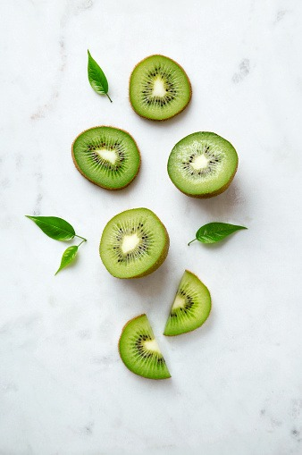
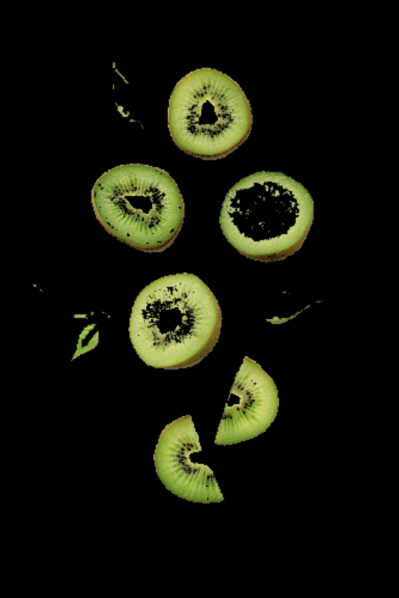

## Remove Background 
---
Bu projede verilen kivi resminde kivileri yapraklardan ayırıp sadece kiviler olacak şekilde maskelenip arkaplanın siyah yapılıp kivileri beyaz yapmaktır. 

  

Bunu yaparken maskeleme yontemi, hsv renk uzayı ile renk tespiti yapılıp contur bulunarak objeler arkaplandan ayrılmıştır. 

Program çalıştırıldığında bu sonuçları vermektedir; 

  

Bu kısımda kiviler arkaplandan ayrılmış ve maskeleme işlemi gerçekleştirlmiştir ancak istenilen sonuç bu değildir.

  

Gerekli contur işlemleri ve morfolojik işlemler uygulandıktan sonra en çok bizden istenen çıktı. 

